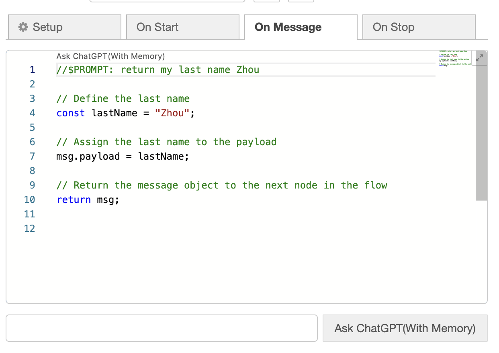

# Node-RED Function Node with integrated ChatGPT With Memory, Multi-turn Conversations Support

The Code based on [@flowfuse/node-red-function-gpt](https://github.com/FlowFuse/node-red-function-gpt),Thanks for their contribution

A Node-RED node that adds an "Ask ChatGPT(With Memory)" input and button to a duplicate of the built-in function node.


## Installation

To add the node to your own instance of Node-RED:

1. Open the "Menu" inside Node-RED
1. Click "Manage palette"
1. Select the "Install" tab
1. Search "chatgpt"
1. Install the `node-red-function-gpt-with-memory` node

You will need a [valid API Key from OpenAI](https://platform.openai.com/account/api-keys)

## How to Use

### Basic Example


1. Add the Function GPT nodes to your editor
2. Configure your ChatGPT credentials
3. Deploy your nodes
4. Open the function-gpt node
5. Type your prompt into the text input at the bottom of the editor panel and click "Ask ChatGPT(With Memory)".

### New Features

Contributed by [Zhou Xingyu](https://github.com/strutter0816)

The node now includes several enhanced features:

1. **Memory Management**: The node maintains conversation history for each instance
2. **Multi-turn Conversations**: Support for multi-turn conversations with ChatGPT, enabling more complex and contextual interactions.
3. **Improved User Experience**: After asking a question, the input field is automatically cleared for a smoother workflow.

Basic example for memory


GPT can remember what I said before  


### Inline Prompts

If you want to inject code into already written content, you can write an inline prompt. These prompts are written as comments, e.g.:

```js
//$PROMPT: Double the input
```

If you've configured Node-RED to use the "Monaco" editor, this will then show an "Ask ChatGPT(With Memory)" hyperlink above the inserted comment, that you can click to ask this to ChatGPT.


You can have as many of these within the function node as you like.

## Troubleshooting

After adding the node to the palette, you do currently need
to "Deploy", before you can use the integrated ChatGPT prompt.

## Copyright

This code is derived from the [core Node-RED Function node](https://github.com/node-red/node-red/blob/master/packages/node_modules/%40node-red/nodes/core/function/10-function.js) that is copyright OpenJS Foundation and licensed under the Apache License, Version 2.0
